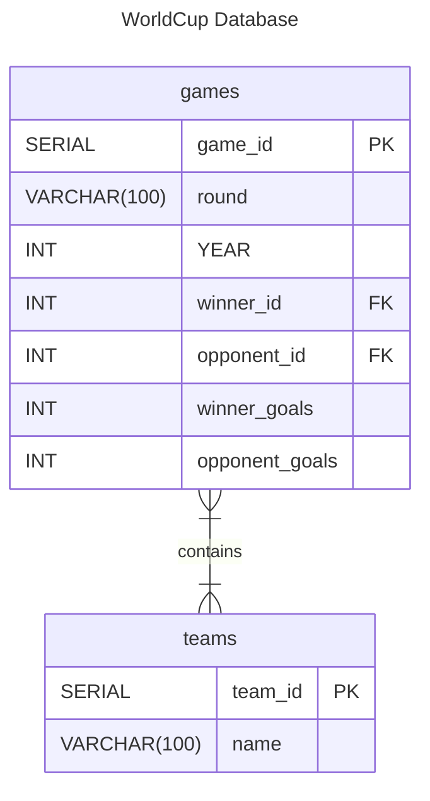

# worldcup_database_using_bash_n_psql
 This project has the SQL commands for creating the Worldcup database based on FreeCodeCamp's relational database project. It also contains a bash script for inserting data from the CSV file into the database.

